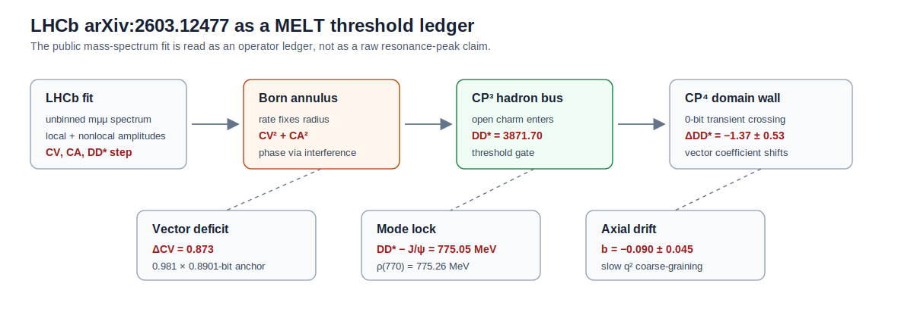

# Vector Thresholds as a MELT Ledger

## A compact reading of LHCb arXiv:2603.12477

**Draft status:** working note, April 2026  
**Target length:** 4-6 pages  
**Primary paper:** LHCb arXiv:2603.12477  
**Public data:** LHCb Zenodo DOI `10.5281/zenodo.19497184`  

### Abstract

LHCb's 2026 amplitude analysis of $B^+\to K^+\mu^+\mu^-$ is not a
classic angular-observable paper. It is an unbinned amplitude analysis of the
dimuon mass spectrum over $300<m_{\mu\mu}<4700\,\mathrm{MeV}/c^2$, with
local Wilson coefficients and nonlocal charm/light resonances fitted in one
model. In the published interpretation the result is a familiar vector-sector
deficit: the preferred effective coefficient $C_V=C_9+C_9'$ is below its
Standard Model value, with the stated tension depending strongly on the
chosen lattice-QCD form factors.

This note asks a narrower question: how does the result look when read through
the local MELT bookkeeping rules? Three structures stand out. First, the
two-dimensional likelihood in $(C_V,C_A)$ is annular because the short-distance
branching fraction constrains mainly $C_V^2+C_A^2$; this is exactly the
observable shape expected from a Born-style modulus readout. Second, the
paper reports a step-like vector response at the open-charm $DD^{\ast}$ threshold,
$\Delta_{DD^{\ast}}=-1.37\pm0.53$, while a simple binned count model does not see
a standalone bump. This supports the reading that the effect lives in the
operator/amplitude ledger rather than in raw event counts. Third, the
threshold arithmetic is unusually sharp:

$$
m_{DD^{\ast}}-m_{J/\psi}=775.05\,\mathrm{MeV},\qquad
m_{\rho}=775.26\,\mathrm{MeV}.
$$

Thus the reported vector-sector gate opens almost exactly at
$J/\psi+\rho(770)$. In MELT terms this is a candidate mode-lock between the
hidden charm carrier and a light vector quantum, occurring at the CP³
hadron-bus to CP⁴ domain-wall transition.

*Figure 1. Minimal map used in this note. LHCb provides the mass-spectrum
amplitude fit; MELT reads its annulus, vector threshold, and axial drift as a
CP³/CP⁴ ledger rather than as a new raw resonance peak.*

## 1. What LHCb Actually Measured

The LHCb paper studies $B^+\to K^+\mu^+\mu^-$ using an effective Hamiltonian
with Wilson coefficients $C_i$ multiplying local operators $O_i$. Heavy
degrees of freedom are integrated out; what remains is a set of operator
channels whose coefficients are inferred from data. The local combinations of
interest are

$$
C_V = C_9 + C_9',\qquad C_A = C_{10}+C_{10}'.
$$

The analysis uses the full reconstructed dimuon mass range and includes
one-particle and two-particle nonlocal amplitudes. The Zenodo release gives
the selected unbinned dimuon masses, plus the background line shape, background
fraction, efficiency curves, and resolution functions needed to reproduce the
published mass-spectrum analysis at the support-curve level.

The headline numbers used in this note are:

| Quantity | Paper-level value used here | Role |
|---|---:|---|
| $C_V^\mathrm{SM}$ | $4.273$ | SM vector anchor |
| $C_A^\mathrm{SM}$ | $-4.166$ | SM axial anchor |
| $C_V^\mathrm{fit}$ | $\approx 3.4$ | preferred vector value |
| $C_A^\mathrm{fit}$ | $\approx -3$ | preferred axial value |
| $C_A(q^2)$ slope | $b=-0.090\pm0.045$ | residual scale drift |
| $C_V$ step at $DD^{\ast}$ | $\Delta_{DD^{\ast}}=-1.37\pm0.53$ | threshold response |

The reported Standard Model tension is not a single invariant headline. With
HPQCD form factors LHCb quotes about $4.0\sigma$; with FNAL/MILC form factors
the same analysis gives about $1.6\sigma$. That dependence matters. In this
note the form-factor dependence is treated as a guardrail: the robust object is
not "new particle found", but the pattern of how the vector and axial ledgers
move when the nonlocal charm model is included.

## 2. MELT Basics Needed Here

Only three pieces of MELT bookkeeping are needed for this note.

### 2.1 Born Readout

MELT distinguishes a pre-readout complex or hermitian ledger from the scalar
quantity observed after Born projection. For a complex amplitude $u=a+bi$ the
Born readout keeps

$$
u\bar u=a^2+b^2,
$$

while the holomorphic square

$$
u^2=(a^2-b^2)+2ab\,i
$$

keeps a directed off-diagonal phase. The claim is not that Born's rule fails
as a measurement prescription. The claim is that a modulus-squared readout is
incomplete as geometry because it removes the directed phase.

This is why an annular likelihood matters. If a fit primarily constrains
$C_V^2+C_A^2$, it is reading a radius in coefficient space. Orientation is
then recovered only through interference with nonlocal amplitudes. That is the
same pattern as: norm first, phase later.

### 2.2 CP³/CP⁴/CP⁵ Bridge

In the local MELT inventory the bridge between hadronic and lepton/vector
readout is the classical band

$$
\mathrm{CP}^3+\mathrm{CP}^4+\mathrm{CP}^5 = 28+0+4 = 32\ \mathrm{bit}.
$$

The roles are:

| CP block | MELT role | Meaning in this note |
|---|---|---|
| CP³ | 28-bit hadron bus | charm/hadron channel enters |
| CP⁴ | 0-bit domain wall | transient threshold, no stable storage |
| CP⁵ | 4-bit lepton/vector bus | $\mu^+\mu^-$ readout exits |

The decay $B^+\to K^+\mu^+\mu^-$ is therefore a good test surface: it starts
in a hadronic transition, exits through a lepton pair, and is modeled by
Wilson coefficients that separate vector and axial operator channels.

### 2.3 Ballast Bit

A recurring local anchor is a first-split ballast value near $0.8901$ bit.
Here it is not used as proof. It is used as a scale marker for the vector
deficit:

$$
\Delta C_V = C_V^\mathrm{SM}-C_V^\mathrm{fit}
\approx 4.273-3.4=0.873.
$$

Thus

$$
\frac{\Delta C_V}{0.8901}\approx0.981.
$$

This is close enough to motivate a ledger comparison, but it must be checked
against the exact likelihood tables before becoming a quantitative claim.

## 3. The LHCb Result as a MELT Ledger

The working map is:

| LHCb object | Operator reading | MELT reading |
|---|---|---|
| annular $(C_V,C_A)$ likelihood | rate fixes $C_V^2+C_A^2$ | Born-like modulus readout |
| lower $C_V$ | vector coefficient deficit | one bridge/ballast unit missing |
| $DD^{\ast}$ step in $C_V$ | vector threshold response | CP³→CP⁴ channel opens |
| $C_A(q^2)$ slope | axial coefficient not fully local | incomplete coarse-graining |
| $DD^{\ast}-J/\psi\simeq\rho$ | light-vector mode lock | explains vector, not scalar, selector |

The annular part is the conceptual bridge. In ordinary operator language,
the short-distance branching fraction constrains the combination
$C_V^2+C_A^2$. In MELT language, this is a Born-like readout of a two-component
coefficient vector. The fit does not initially know the orientation; it only
recovers it through interference against nonlocal amplitudes. That is exactly
the kind of "phase hidden in the cross-channel" behavior expected if the
observable is downstream of a modulus projection.

Numerically, using the approximate headline values:

$$
R_\mathrm{SM}=\sqrt{4.273^2+(-4.166)^2}=5.968,
$$

$$
R_\mathrm{fit}\approx\sqrt{3.4^2+(-3.0)^2}=4.534.
$$

The radial deficit is

$$
\Delta R\approx1.433.
$$

That is close to the size of the reported threshold step:

$$
\frac{\Delta R}{|\Delta_{DD^{\ast}}|}
=\frac{1.433}{1.37}
\approx1.046.
$$

Again, this is a working ledger comparison, not a substitute for the LHCb
fit. The point is that the size of the annular shrinkage and the size of the
reported vector threshold gate live on the same scale.

## 4. The DD* Gate and the Rho Mode Lock

The strongest compact observation is pure mass arithmetic:

$$
m_{DD^{\ast}}=3871.70\,\mathrm{MeV},\qquad
m_{J/\psi}=3096.65\,\mathrm{MeV}.
$$

Therefore

$$
m_{DD^{\ast}}-m_{J/\psi}=775.05\,\mathrm{MeV}.
$$

The $\rho(770)$ mass is approximately

$$
m_\rho=775.26\,\mathrm{MeV}.
$$

So the difference is

$$
(m_{DD^{\ast}}-m_{J/\psi})-m_\rho=-0.21\,\mathrm{MeV},
$$

or a relative ratio of about $0.999729$.

This matters because LHCb's reported threshold response is in $C_V$, the
vector coefficient. The open-charm $DD^{\ast}$ threshold is almost exactly one
light-vector quantum above $J/\psi$. In a conservative Standard Model reading
this is a notable alignment of thresholds and vector resonances. In the MELT
reading it is the proposed reason the anomaly selects a vector operator rather
than a scalar one: the threshold opens as a mode-locked vector gate.

There is a second, weaker charm-ladder marker:

$$
m_{DD^{\ast}}-m_{DD}=142.02\,\mathrm{MeV},
$$

$$
m_{D^{\ast}D^{\ast}}-m_{DD^{\ast}}=142.00\,\mathrm{MeV}.
$$

This is simply the repeated $D^{\ast}-D$ spin gap. In MELT language it may echo the
real leg of the local $\Delta=14+28i$ ledger at a factor of ten, but this is
only a weak marker. The $\rho$ lock is much cleaner.

## 5. What the Public Data Say Before the Full Fit

The open Zenodo files were downloaded and checked locally. The selected
dataset contains $3,363,943$ unbinned dimuon mass values. It is dominated by
the $J/\psi$ and $\psi(2S)$ regions:

| Diagnostic | Value |
|---|---:|
| event count | $3,363,943$ |
| median mass | $3097.328\,\mathrm{MeV}/c^2$ |
| 1st percentile | $3074.131\,\mathrm{MeV}/c^2$ |
| 99th percentile | $3693.694\,\mathrm{MeV}/c^2$ |

A naive side-window scan is useful only as a diagnostic. It shows:

| Marker | Raw side-window result |
|---|---:|
| $J/\psi$ symmetric check | $\log_2(R/L)=-0.023$ |
| $DD^{\ast}$, 50 MeV windows | $\log_2(R/L)=-0.459$ |
| $DD^{\ast}$, 100 MeV windows | $\log_2(R/L)=-0.714$ |

The $DD$ and $\psi(3770)$ windows are contaminated by the huge $\psi(2S)$ tail
on the left side, so their raw count jumps should not be interpreted as
threshold physics.

A deliberately crude binned Poisson smoke test was also run over
$3760$ to $4250\,\mathrm{MeV}/c^2$. It compared a smooth continuum plus broad
Gaussian resonance anchors with and without a sigmoid step at $DD^{\ast}$. The
fitted step direction was negative, but the added step was not favored by
AIC/BIC:

$$
\Delta\mathrm{AIC}=+1.845,\qquad
\Delta\mathrm{BIC}=+4.429,
$$

with fitted step amplitude $-0.590$ in that crude model.

This is not a contradiction of the LHCb result. It is the useful lesson. The
$DD^{\ast}$ effect is not a raw histogram bump. It is an amplitude-level
Wilson/nonlocal effect. That is precisely why it is interesting as a MELT
ledger object.

## 6. Falsification and Next Work

The MELT reading should be treated as a structured hypothesis with clear
failure modes.

It weakens if:

1. a reproduction of the LHCb likelihood absorbs the $DD^{\ast}$ step into smooth
   charm-loop modeling;
2. the step moves away from the vector coefficient when alternative form
   factors are used;
3. the annular $(C_V,C_A)$ profile disappears in a more complete likelihood;
4. the $J/\psi+\rho$ threshold lock has no explanatory value across related
   channels.

It strengthens if:

1. the $DD^{\ast}$ response remains vector-specific;
2. the threshold gate persists under HPQCD/FNAL-MILC variations;
3. analogous $J/\psi+\rho$ or vector-mode locks appear in related
   $b\to s\mu^+\mu^-$ channels;
4. the $C_A(q^2)$ drift remains as a gradual scale term while $C_V$ carries
   the discrete threshold gate.

The next technical step is not another verbal interpretation. It is a
minimal amplitude-level reproduction over the charm window using the published
efficiency and resolution curves: smooth continuum, $\psi(2S)$,
$\psi(3770)$, $\psi(4040)$, $\psi(4160)$, and a $DD^{\ast}$ sigmoid gate, compared
by likelihood rather than by raw counts. Only then should the $0.873$ vector
deficit and the $0.8901$ ballast marker be promoted from "numerical hook" to
"quantitative claim."

### References and Framework Anchors

- LHCb collaboration, *Measurement of the local and nonlocal amplitudes in
  $B^+\to K^+\mu^+\mu^-$ decays*, arXiv:2603.12477.
- LHCb Zenodo data release, DOI `10.5281/zenodo.19497184`.
- MELT bridge inventory: CP³/CP⁴/CP⁵ as hadron-bus/domain-wall/lepton-bus
  bookkeeping.
- MELT Born/off-diagonal inventory: modulus readout versus retained
  off-diagonal phase.
